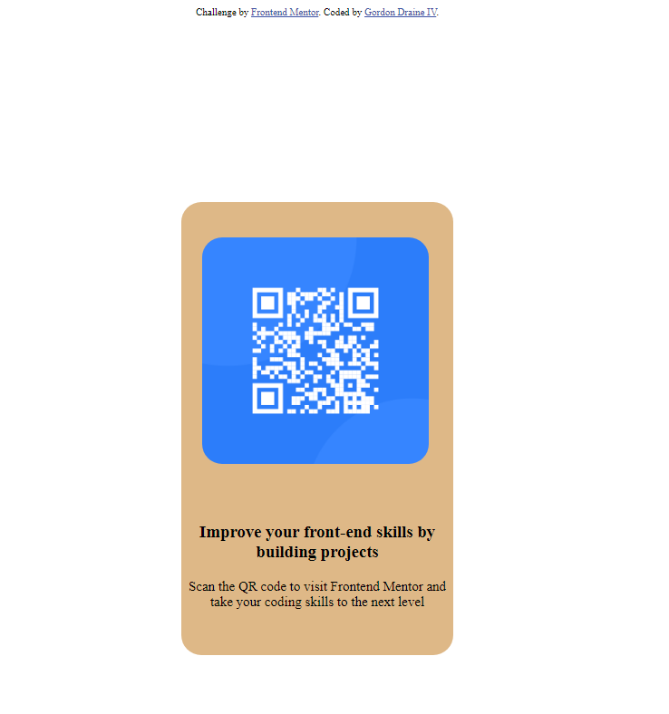
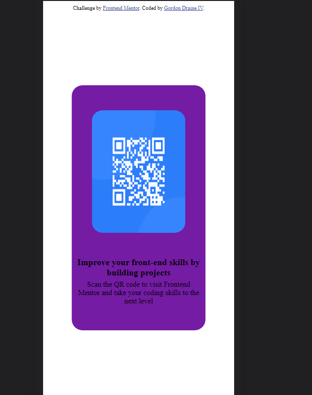

# Frontend Mentor - QR code component solution

This is a solution to the [QR code component challenge on Frontend Mentor](https://www.frontendmentor.io/challenges/qr-code-component-iux_sIO_H). Frontend Mentor challenges help you improve your coding skills by building realistic projects.

## Table of contents

- [Overview](#overview)
  - [Screenshot](#screenshot)
  - [Links](#links)
- [My process](#my-process)
  - [Built with](#built-with)
  - [What I learned](#what-i-learned)
  - [Continued development](#continued-development)
  - [Useful resources](#useful-resources)
- [Author](#author)
- [Acknowledgments](#acknowledgments)

**Note: Delete this note and update the table of contents based on what sections you keep.**

## Overview

### Screenshot

### Links

- Solution URL: [Add solution URL here](https://your-solution-url.com)
- Live Site URL: [Add live site URL here](https://your-live-site-url.com)

## My process

- wireframe the components
- create divs for the components
- fill divs with content and more syntax
- style tags and format page.
- connect repo to github
- launch site.

### Built with

- Semantic HTML5 markup
- CSS custom properties
- Flexbox
- CSS Grid
- Mobile-first workflow

### What I learned

I learned better syntax skills and better formatting skills in this challenge.

### Continued development

I will continue on usiong border radius correct padding spacing and better accesable colors in my future projects.

### Useful resources

- [resource 1](https://developer.mozilla.org/en-US/docs/Web/CSS/CSS_Text/Wrapping_Text) - This helped me for figuring the syntax out for wrapping the text. I really liked using this solution to solve my problem.

## Author

- Website - [Gordon Draine IV](https://www.your-site.com)
- Frontend Mentor - [@yourusername](https://www.frontendmentor.io/profile/yourusername)
- Twitter - [Gordon Draine Twitter.](https://twitter.com/Gordy_40)

**Note: Delete this note and add/remove/edit lines above based on what links you'd like to share.**
